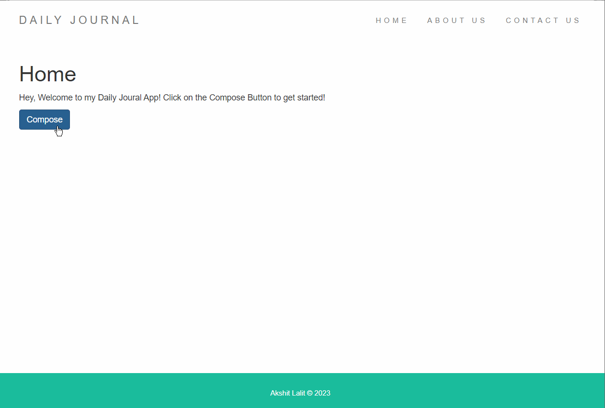
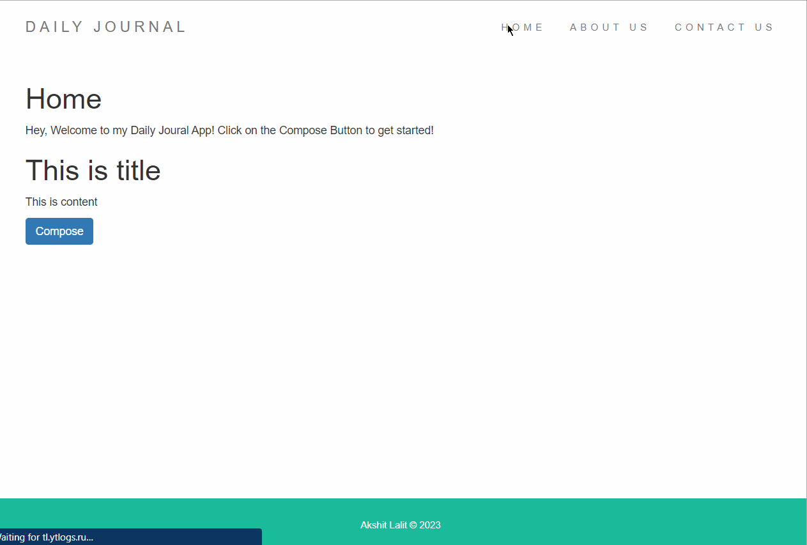

# Daily Journal

- The Daily Journal App is a web-based application that allows users to write and store their daily journal entries. 
- It provides a simple and intuitive interface for users to jot down their thoughts, reflect on their day, and keep a record of their experiences.

- <a href="https://daily-journal-kohl.vercel.app/">Deployed Link</a>




## Features

- Create journal entries: Write and save daily journal entries.
- Browse functionality: Easily navigate through past entries.
- Responsive design: Enjoy a seamless experience on different devices and screen sizes.
- Routes created automatically when posts are composed.

## Installation

1. Clone the repository:

```bash
    git clone https://github.com/Akshit1903/Daily-Journal
```

2. Install the dependencies:

```bash
    cd daily-journal
    npm install
```

3. Start the application:

```bash
    node index.js
```

4. Open your web browser and visit `http://localhost:3000` to access the Todo App.

## Usage

- Create a new journal entry by clicking the "Compose" button.
- Write your journal entry in the provided editor, providing a suitable title as well.
- Save the entry to store it in your journal.
- Browse through past entries using the home route.

## Technologies Used

- EJS: Templating engine for rendering dynamic content.
- Express: Web application framework for Node.js.
- Node.js: JavaScript runtime environment.
- HTML: Markup language for creating the structure of the web pages.
- CSS: Styling language for enhancing the appearance of the web pages.
